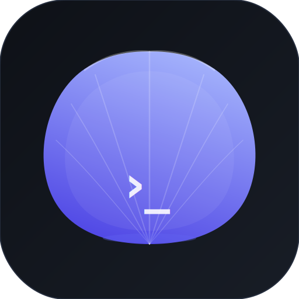
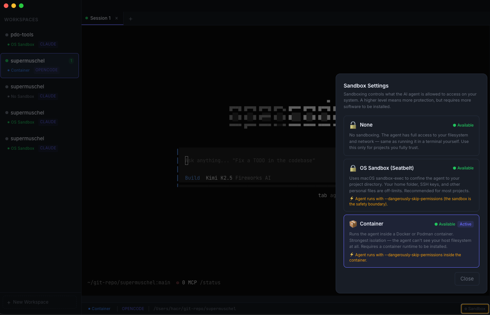

<div align="center">
  
  <h1>Supermuschel</h1>
  <p><strong>An AI agent terminal with first-class sandboxing</strong></p>
  <p>
    
    
    
  </p>
</div>

---



---

Supermuschel (_German: super shell_) is a desktop app that wraps **Claude Code** and **OpenCode** as AI agent terminals with tiered sandboxing baked directly into the UI — the first tool in the market to ship "YOLO mode, home directory stays home" as a default. Runs on macOS and Linux.

## Features

- **Tiered sandboxing** — three levels, picked per workspace:
  - **None** — full system access (trusted projects only)
  - **OS Sandbox** — macOS `sandbox-exec` (Seatbelt) or Linux `bwrap` (Bubblewrap). Restricts the agent to the project directory; home dir is protected.
  - **Container** — Podman rootless or Docker. Strongest isolation, separate filesystem.
- **Agent-writable sidebar** — agents call the `supermuschel` CLI to push live status badges, progress bars, and flash animations into the UI without any polling.
- **Claude Code + OpenCode** — detected automatically from `$PATH`.
- **xterm.js terminal** — full PTY, 256-color, JetBrains Mono, WebLinks addon.
- **Premium dark/light UI** — adapts to macOS System Preferences, Inter + JetBrains Mono, indigo accent.

## Agent CLI

When Supermuschel launches an agent, it injects the `supermuschel` binary into the agent's `$PATH`. Agents can call:

```bash
supermuschel set-status branch "feat/auth" --icon arrow.triangle.branch
supermuschel set-progress 0.75          # shows 75% bar in the sidebar
supermuschel notify --title "Done" --body "Tests pass"
supermuschel trigger-flash              # pulses the workspace card border
```

## Sandbox levels

| Level | Name | How | `--dangerously-skip-permissions` |
|---|---|---|---|
| 0 | None | passthrough | ❌ never |
| 1 | OS Sandbox | macOS: `sandbox-exec -f profile.sb` · Linux: `bwrap --ro-bind / /` | ✅ (sandbox is the boundary) |
| 2 | Container | `podman run` / `docker run` | ✅ |

## Tech stack

| Layer | Choice |
|---|---|
| Shell | Electron 34 |
| Build | electron-vite + Vite 5 |
| Renderer | React 19 + Tailwind v4 |
| Routing | TanStack Router |
| IPC | tRPC v11 + custom Electron link |
| DB | Drizzle ORM + better-sqlite3 |
| Terminal | xterm.js 5 + node-pty |
| Monorepo | Turborepo + Bun |
| Linting | Biome |

## Getting started

```bash
# Install dependencies
bun install

# Start development (Electron + Vite HMR)
cd apps/desktop && bun run dev

# Rebuild native modules (first time, after bun install)
cd apps/desktop && bun run rebuild

# Type-check everything
bun run typecheck

# Production build
cd apps/desktop && bun run build
```

### Prerequisites

- macOS 14+ (Sonoma) or macOS 15 (Sequoia)
- [Bun](https://bun.sh) ≥ 1.3
- [Claude Code](https://claude.ai/code): `npm i -g @anthropic-ai/claude-code`
- [OpenCode](https://opencode.ai) (optional): `brew install sst/tap/opencode`
- Docker or Podman (optional, for Level 2 sandbox)

## License

MIT
